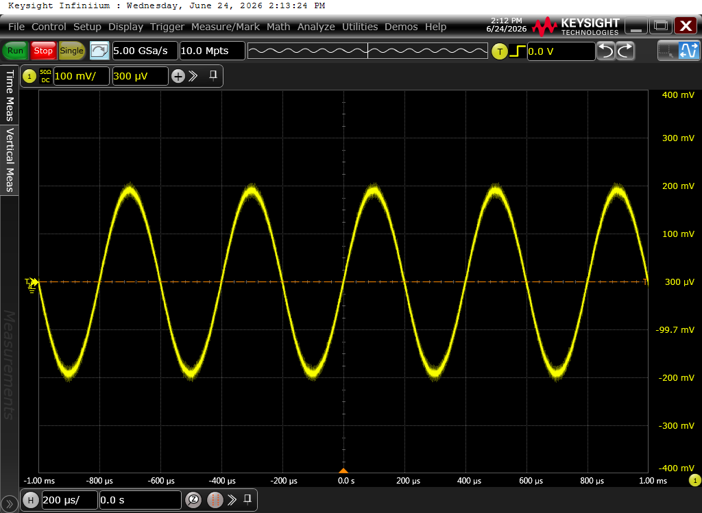
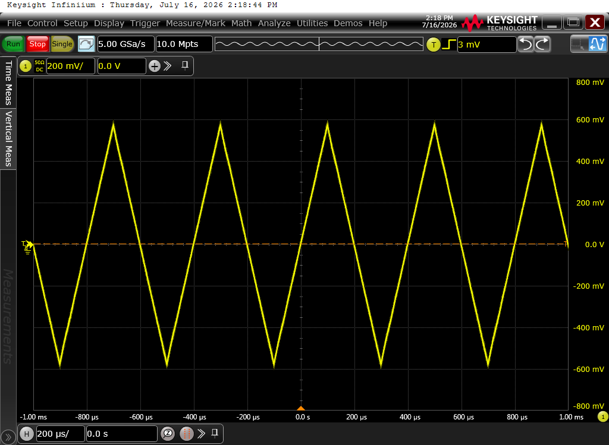
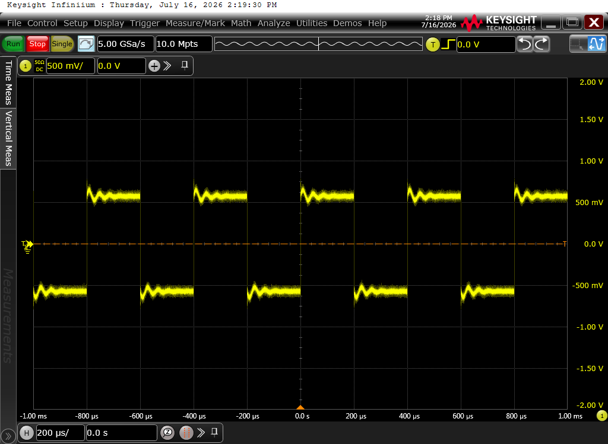
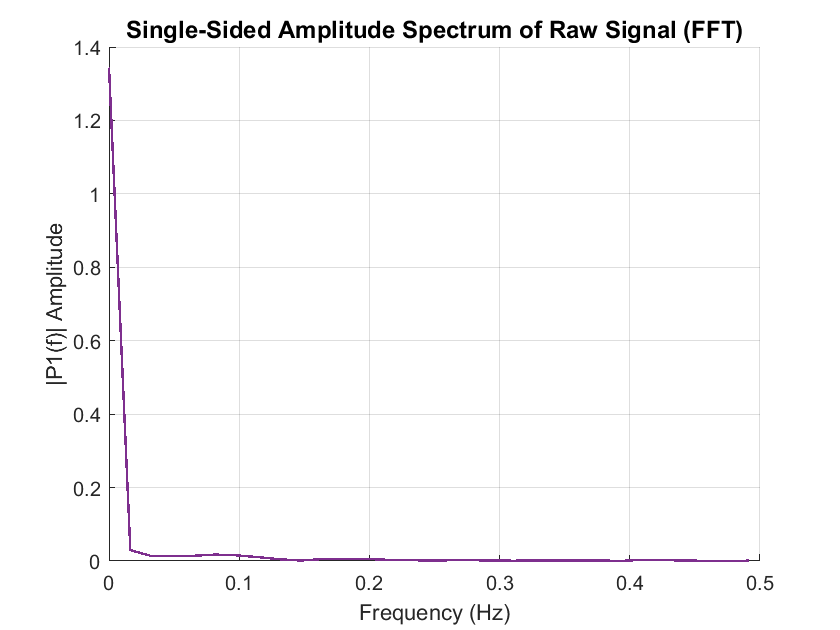
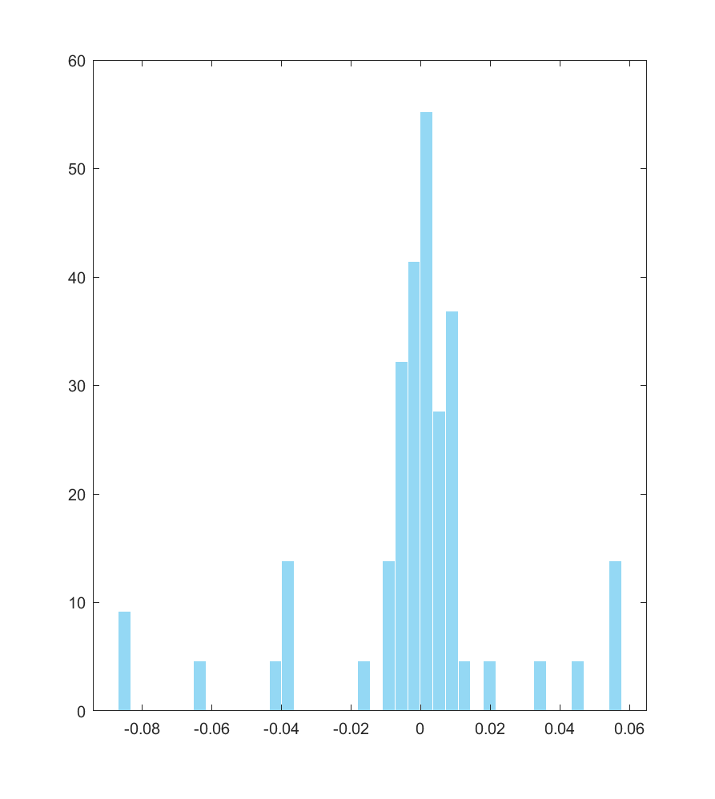

# 📡 Remote Laboratory Instrument Automation using Python

A Python-based automation framework designed for **remote control, real-time data acquisition, and verification of laboratory instruments**. By leveraging the **PyVISA** library and executing **SCPI** (Standard Commands for Programmable Instruments) commands over TCP/IP, this system bypasses manual lab measurements to enable fast, repeatable, and automated experimental workflows.

> ✱ **Core Use Case:** Perfect for Hardware-in-the-Loop (HIL) testing, component characterization, and validating physical circuits against simulated models (e.g., Cadence Virtuoso designs).

## ✱ System Architecture & Stack

The physical and logical integration of the automated testbench is structured as follows:

| Layer | Component & Technologies |
| :--- | :--- |
| **Hardware Components** | Agilent 33612A (Arbitrary Waveform Generator)   Keysight MSO9404A (Mixed Signal Oscilloscope) |
| **Physical Connectivity** | BNC Coaxial Cable (Signal Path)   Ethernet (LAN Cable) |
| **Protocols & Standards** | TCP/IP, VISA Protocol, IEEE 488 (GPIB), SCPI Commands |
| **Automation Engine** | **Python** (PyVISA Control, SCPI Command Dispatcher) |
| **Data Processing & Analytics** | NumPy, Pandas, Matplotlib Plots, Signal Analysis |
## ✱ Hardware Setup

The framework is developed and tested using industry-standard laboratory equipment:

* **Signal Generation:** `Agilent 33612A` Arbitrary Waveform Generator (120 MHz, 2-Channel).
* **Measurement & Capture:** `Keysight MSO9404A` Mixed Signal Oscilloscope (4 GHz, 4 Analog + 16 Digital Channels).
* **Interface Protocols:** VISA (Virtual Instrument Software Architecture) API over LAN (TCP/IP).

---

## ✱ Projects completed

### 1. Remote creation of pulses
* Python scripts with pyvisa library that controls the instruments to create pulses.
* Dynamic configuration of output wave shapes (Sine, Sqyare, Trg, Ramp).
* Sweep constrols for frequency and amplitude values.

### 2. Remote creation of pulses and screenshots on oscilloscope's screen
* Screeshot data from oscilloscope screen when waveforms occur.
* Saving screenshots in desktop accurately on time and clarity.
* Oscilloscope Screenshots:

| Triangle Wave | Sine Wave | Square Wave |
|:-------------:|:---------:|:-----------:|
|  |  |  |

### 3. Oscilloscope Data Acquisition (simple case)
* Direct export of captured waveforms to structured `.csv` files.
* Input signal (Vpp): 1V
* Matlab signal Processing, FFT, statistical Analysis
* Key finds:
  - FILTERING & SNR:
    1. constant systematic error of +0.35V (need for instument callibration in DAQ system)
    2. moving average filter of N=15 to cancel high frequences
    3. SNR=4.41dB (existance of raw noise through the signal)
  - FTT ANALYSIS:
    1. 0Hz is the domain frequence (DC)
    2. random non periodic low frequence noise (no other noise)
  - NOISE STATICS:
    1.  noise is of little window (+-10mV)
    2.  small voltage glitches

| Signal Filtering & Noise Extraction | FTT | Noise Statics |
|:-------------:|:---------:|:-----------:|
|  |  |  |

*Developed in personal interest and experimental test automations at ECE NTUA labs.*
